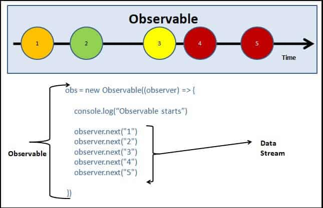

# RxJS-basic-2023

## Starting playground
- `cd playground`
- `npm i --legacy-peer-deps`
- `npm run dev`

## Examples
The examples are the examples sub-directory.

## Lessons

### Lesson-01

### Lesson-02
- [Observable creation](http://localhost:3000/rxjs/constructor/)
  
### Lesson-03
